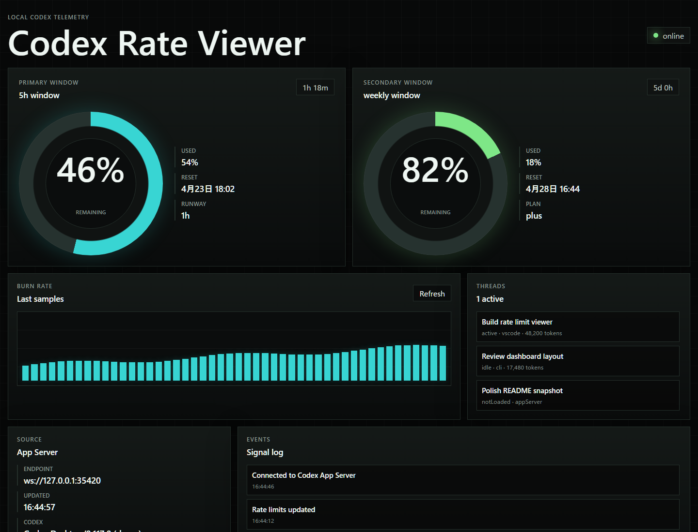

# Codex Rate Viewer

Codex の残りレートをローカルでリアルタイム表示する小さなビューアーです。依存パッケージなしで動き、Codex App Server の `account/rateLimits/read` と `account/rateLimits/updated` を使って 5h / weekly の使用率、リセット時刻、直近の消費ペースを表示します。



README の画像は `?demo=1` で描画したサニタイズ済みのサンプル表示です。

## 起動

```powershell
npm start
```

ブラウザで `http://127.0.0.1:8787` を開きます。

Codex のサンドボックス内で Node から子プロセス起動が拒否される場合は、App Server を別ターミナルで先に起動します。

```powershell
codex app-server --listen ws://127.0.0.1:35420
$env:CODEX_APP_SERVER_URL = "ws://127.0.0.1:35420"
npm start
```

## 設定

- `VIEWER_PORT`: ビューアーの HTTP ポート。既定値は `8787`
- `APP_SERVER_PORT`: 自動起動する Codex App Server の WebSocket ポート。既定値は `35420`
- `CODEX_APP_SERVER_URL`: 既存の App Server に接続する場合の URL。例: `ws://127.0.0.1:35420`
- `CODEX_SPAWN_APP_SERVER=0`: App Server を自動起動しない
- `CODEX_BIN`: `codex` 実行ファイルのパスを明示する

## Playwright CLI

このプロジェクトには `@playwright/cli` を dev dependency として入れています。

```powershell
npm run pw -- --help
npm run pw:open
```

## GitHub

このローカル作業ツリーは次のリポジトリを `origin` に設定しています。

```text
https://github.com/hiro-collab/codex-rate-viewer.git
```

## メモ

Codex App Server はローカルホストにのみバインドします。ビューアーも `127.0.0.1` で起動し、API キーや認証トークンを保存しません。
